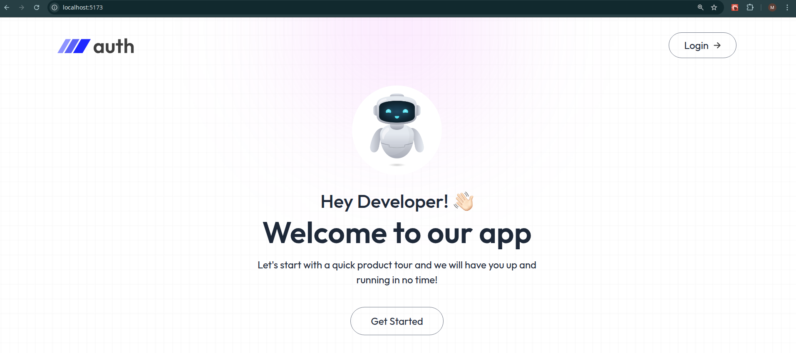
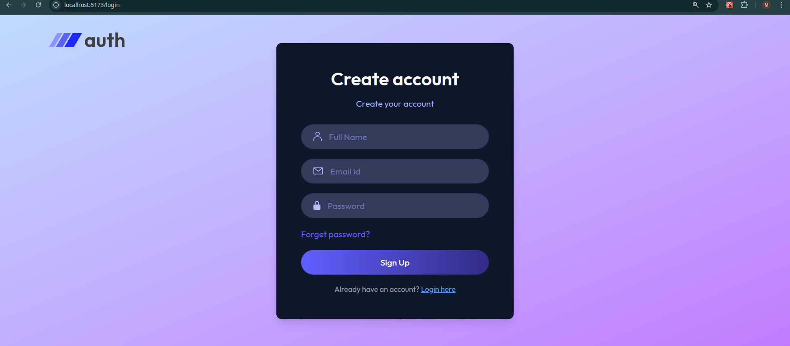
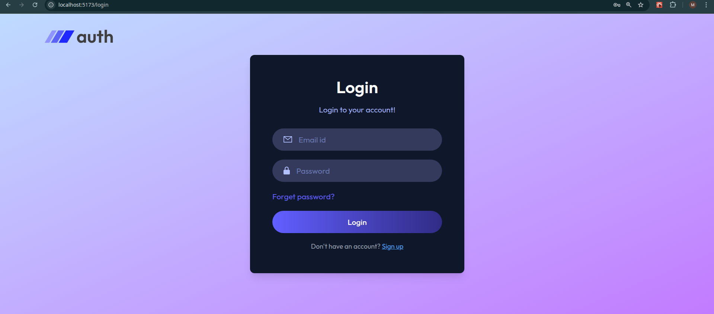
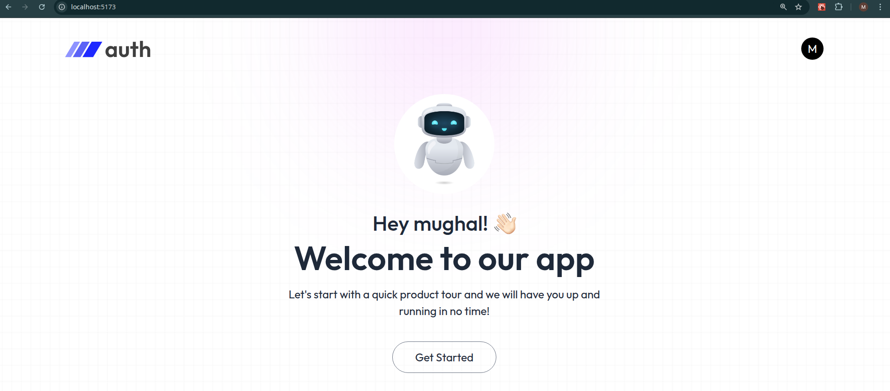
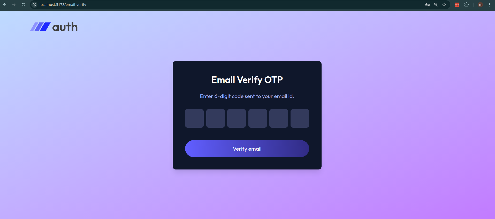
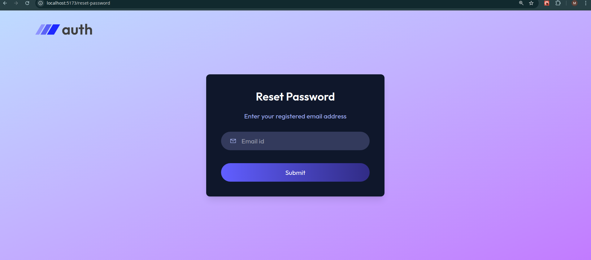

# 🔐 MERN Advanced Authentication System


A secure, production-ready full-stack web application demonstrating a complete user authentication flow. This project handles everything from password hashing and secure cookies to email verification using One-Time Passwords (OTPs).

**[🔴 Live Demo: Coming Soon]** <!-- Add your Vercel/Render link here when you deploy! -->

---

## 📸 Project Preview
MERN Authetication Preview

Sign Up Page

Login Page

After Logging In

Verify Email Page

Reset Password Page


---

## ✨ Key Features
* **Complete Auth Flow:** End-to-end User Registration, Login, and Logout functionality.
* **Email OTP Verification:** Integrates `Nodemailer` to send real 6-digit codes to users for account verification and password resets.
* **Auto-Advancing OTP UI:** Custom-built React logic for seamless OTP entry, handling clipboard pasting, backspace correction, and automatic focus shifting.
* **Secure Cookie Management:** Uses HTTP-only JSON Web Tokens (JWT) for stateless, secure session management without exposing tokens to local storage.
* **Protected Routing:** Utilizes React Context API and React Router to securely block unauthenticated users from accessing private dashboard pages.

---

## 🛠️ Tech Stack
* **Frontend:** React.js (Vite), Tailwind CSS, React Router DOM, Axios, React Toastify
* **Backend:** Node.js, Express.js
* **Database:** MongoDB (via Mongoose)
* **Authentication:** JSON Web Tokens (JWT), bcrypt (Password Hashing)
* **Email Service:** Nodemailer

---

## 🧠 Technical Highlights & Learnings
While building this full-stack application, I focused deeply on bridging the gap between frontend user experience and backend security protocols:
1. **Cross-Origin Security & Cookies:** Mastered configuring Axios (`withCredentials: true`) and Express CORS policies to successfully transmit secure, HTTP-only cookies between a decoupled frontend and backend.
2. **React Refs & DOM Manipulation:** Architected a dynamic array of `useRef` hooks to actively control the DOM, allowing an OTP input form to instantly move the user's cursor between 6 separate boxes based on keyboard events.
3. **Event Closures in React:** Deepened my understanding of how JavaScript closures work during render cycles (e.g., mapping arrays) versus event time, ensuring complex state indices didn't crash the application.
4. **Global State Management:** Designed an `AppContent` Context Provider to fetch user authentication status globally on app load, drastically reducing redundant API calls and simplifying component logic.

---

## 💻 Local Setup Instructions

Want to run this project locally? Follow these steps to spin up both the backend and frontend servers:

### 1. Clone the repository
```bash
git clone https://github.com/umersaif11/mern-auth-system.git

cd mern-auth-system
   ```
### 2. Setup the Backend
1. Open a terminal and navigate to the backend directory:
```bash
   cd backend
   npm install
```    
2. Create a .env file in the backend folder and add your variables:
```bash
MONGODB_URI=your_mongodb_connection_string
JWT_SECRET=your_super_secret_jwt_key
SMTP_USER=your_email_address
SMTP_PASS=your_email_app_password
SENDER_EMAIL=your_email_address
PORT=4000
```  
3. Start the backend server:
```bash
npm run server
```  
### 2. Setup the Frontend
1. Open a new terminal window and navigate to the frontend directory:
```bash
   cd frontend
   npm install
```    
2. Create a .env file in the frontend folder and link it to your backend:
```bash
VITE_BACKEND_URL=http://localhost:4000
```  
3. Start the frontend development server:
```bash
npm run dev
```  
